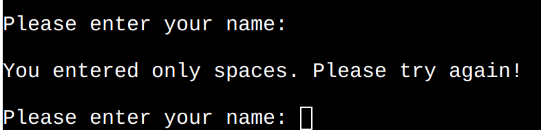
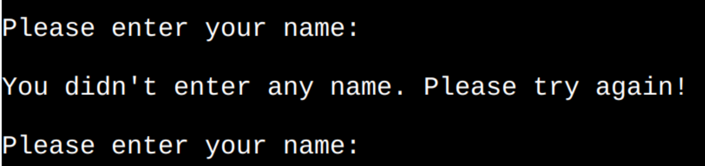

# Hangman

Hangman is a Python terminal game, which runs oin the Code Institute mock terminal on Heroku.

Users get a possibility to play a guessing game even if they do not have someone around to play with.

## How to play

 The player will have a total of nine attempts to correctly guess the word. Guessing multiple letters at once is not possible.If the playes enters a character other than a letter, they will receive an error message.

 When the player guess a letter, the game shows if it is correct and if it is, reveals its position in the word.

 If a letter is not in the word, a new image of the hangman is displayed, along with the number of attempts remaining.

 It is possible to play the game multiple times.

 ## Flowchart

 Flowchart was created using [Lucidchart]("https://www.lucidchart.com/pages/sv")

 

 ## Features 

 ### Welcome message

 
  
  - Tells a player what type of game it is.
  
  - Gives information about the game, amount of attempts, and the possibility to play several times.

  - Requests player's name.

### Name Validation

#### Input validation and error-checking:

  - It is not possible to enter only spaces.

  - A player will get an error message.

  - The error message will continue to display until the player enters a valid name or an empty word. The error message for empty words is shown in the image below.
   

  -  It is not possible to enter an empty word as a name.

  -  A player will get an error message.

  - The error message will continue to display until the player enters a valid name or only whitespaces. The error message for whitespaces is shown in the first image in this section.

### Ready to play?

#### Once validation is complete, the user is given the option to choose either to play or not.

I know it's very early in the game, but what if a user accidentally stumbled upon the game or immediately regretted it?

  
 - The player chooses to play:

    - 

       The game begins. Some time delay is added for animation feeling.

  - The player chooses NOT to play:
   
    - 

      The game welcomes the player to come back another time.

 
### Enter a letter

  - This section shows the first hangman image.

  - A player gets to see the hidden word.

  - A player gets an opportunity to enter a letter.

  - 
  
  

