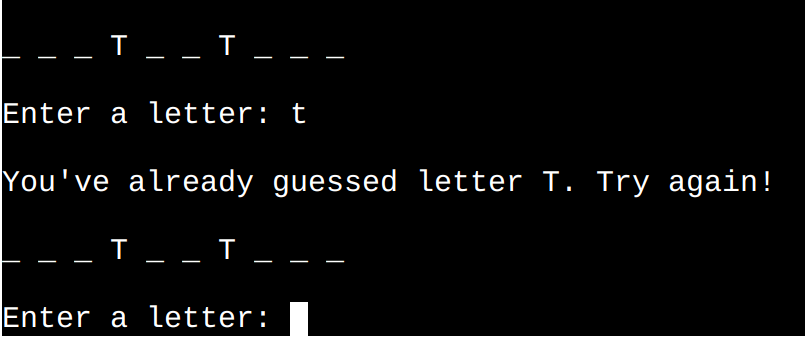

# Hangman

Hangman is a Python terminal game, which runs on the Code Institute mock terminal on Heroku.

Players get a possibility to play a guessing game even if they do not have someone around to play with.

The game provides a perfect escape from daily routine while stimulating the mind.

[Here is the live version of my project](https://guessing-game-hangman-19d0059fa2c6.herokuapp.com/).

## How to play

A random word is selected from a list by the server. The player is then presented with a row of underscores, one for each letter in the chosen word, and asked to guess a letter. The player will have a total of nine attempts to correctly guess the word. Guessing multiple letters at once is not possible. If the player enters a character other than a letter, en error message will be displayed.

When the player guesses a letter, the game shows if it is correct, and if it is, the game reveals letter's position in the word.

If a letter is not in the word, a new image of the hangman is displayed, along with the number of attempts remaining.

The game ends when the player correctly guesses all the letters or runs out of attempts.

It is possible to play the game multiple times.

## Flowchart

Flowchart was created using [Lucidchart](https://www.lucidchart.com/pages/sv).

## Existing Features 

### Welcome message

  
- Tells a player what type of game it is.
  
- Gives information about the game, amount of attempts, and the possibility to play several times.

- Requests player's name.

### Name Validation

#### Input validation and error-checking:

  
  - A player can only enter letters.

  - Nothing else but letters are accepted. 

  - A name should contain at least ONE letter.

### Ready to play?

#### Once validation is complete, the user is given the option to choose either to play or not.

I know it's very early in the game, but what if a user accidentally stumbled upon the game or immediately regretted it?

  
- The player chooses to play:

  

  The game begins. Some time delay is added for animation feeling.

- The player chooses NOT to play:
   
  

  The game welcomes the player to come back another time.
  
- The player enters something else than 'yes' or 'no':
    
  
      
  An error message appears on the screen asking the player to enter either 'yes' or 'no'.

 
### Enter a letter

- This section shows the first hangman image.

- A player gets to see the hidden word.

- A player gets an opportunity to enter a letter:

  - The letter is NOT in the word:

    

    - A player gets a message with the information about that.

    - Information about how many attempts are left is displayed.

    - The next hangman image is displayed.

    - A player can guess the next letter as long as the game is still in progress. 
    
  - The letter IS IN THE WORD:

    

    - A player gets a message with the information about that.

    - The game reveals the guessed letter's position in the word.

    - A player can guess the next letter as long as the game is still in progress. 
    
  - The letter is ALREADY guessed:

    

    - A player gets a message with the information about that.

    - An opportunity to enter another letter appears on the screen.

### The game is finished

#### What occurs when all letters are guessed or no attempts remain?

- Game over:
   
  

  - "You have 0 attempts left" message is displayed on the screen.

  - The last hangman image with the GAME OVER print is printed out for the player.

  - The player receives the information about the word that was previously hidden by the underscores.

  - The game asks whether the player wants to play again or not.

- A player wins:

  

  - Congratulations message is printed out for the player.

  - The game asks whether the player wants to play again or not.

### Would you like to play again?

- YES:
   
  

  - A new random word that is currently hidden behind the underscores, appears on the screen.

  - A player gets an opportunity to enter a letter.

- NO:

  

  A "Welcome back another time!" message appears on the screen.

- Was it YES or NO?

  
  
  If a player enters something else than 'yes' or 'no', a question repeatedly appears on the screen.

### Future Features:

- Make it possible to guess the whole word at once.

- Add some colors to make the game look more appealing (e.g., green for correct answers and red for incorrect answers).

- Create different difficulty levels for the game.

- Show all guessed letters or the letters still available at each guess. That may be relevant if the game grows and becomes more complex.*

  *I tried to print all the guessed letters but decided to go further without that feature to keep the game less complex (with not too much information printed out) and the terminal a little neater.
  Moreover, players are always informed that the letter has already been guessed.

## User Experience

### Key Project Goal

A lot of people have probably played the hangman game with their friends. But what if you feel like playing when you are alone and need a little break from work, studying, or something else you are busy with? The key project goal with the app is to give that break in everyday life while the brain gets a little exercise. The game is easy to play, and it doesn't take that much time to finish the round.

### Target Audience

The best part is that the game is almost for everyone. You could say it's for kids and families. However, the only criteria that exist to be able to qualify for the target group are to know English and love to guess.

### User Stories 

#### As a user I want to be able to:

 - read concise instructions to comprehend the game rules.
 - start a game when I am ready.
 - receive information on what went wrong in case I make an incorrect input.
 - know whether I guessed correctly or incorrectly or if the letter has already been guessed.
 - see the correctly guessed letter revealed in its correct position within the word.
 - see a new hangman image appear, as I guess incorrectly.
 - get information about how many attempts are left, as I guess incorrectly.
 - see the word I was guessing in case I lose the game.
 - start a new game when the current game has ended, regardless of whether I lost or won.

## Solved Bugs after Deployment:

- When a player started a new round after losing, the letters that were correctly guessed in previous rounds were automatically entered as correctly guessed letters even for the new word. I solved the problem by resetting the list of correctly guessed letters every time a player loses the game.

- When a player plays another round after losing, a message was displayed stating that a letter had already been guessed, even if it hadn't been guessed in that particular round. I solved the problem by resetting the list of all the guessed letters every time a player loses the game.

- The same hangman image was displayed twice. The image was displayed at the beginning of the game. The same image was even displayed when the player guessed incorrectly for the first time. I solved this problem by adding one more image to the hangman list to make it work with indexes.

It is maybe not actually a bug, but the time delay before the hangman image was displayed, made it look like the game has hunged. The same applied to the "Would you like to play again?" question. I removed the time delay for better user experience.

## Testing

### Validator testing

No errors were found when passing through the official [PEP8 Linter](https://pep8ci.herokuapp.com/).

### Manual Testing

***{player_choice}** - _the player's specific input_.

***{guess}** - _the player's input/guess_. 

| Feature | Expect | Action | Result | Pass/Fail |
|---------|--------|--------|--------|-----------|
| Enter a name | When trying to input empty words, whitespaces, digits, symbols or a combination of letters and other characters, a player should receive an error message stating "Please enter a name containing at least one letter. NOTE: Only letters are accepted! Avoid spaces.". The message should repeat itself until a valid name is entered | Enter something else than only letters | A "Please enter a name containing at least one letter. NOTE: Only letters are accepted! Avoid spaces." message appears on the screen. The message displays until the entered name contain only letters.| Pass
| Are you ready to play? (YES) | When a player chooses to play and types "yes" into the terminal, "The game begins in..." counting down appears on the screen along with the first hangman image, hidden word, and the possibility to enter a letter. | Type "yes" into the terminal. | The game starts with a countdown, followed by a hangman image and "Enter a letter" section.| Pass
| Are you ready to play? (NO) | When a player chooses not to play and types "no" into the terminal, a player should receive a message stating "You are welcome back another time. Have a nice day!" | Type "no" into the terminal | "You are welcome back another time. Have a nice day!" message appears on the screen. | Pass
| Are you ready to play? (Neither YES or NO) | When a player enters something else than "yes" or "no", a player should receive an error message stating "You entered {player_choice}*, please enter 'yes' or 'no'". The message should repeat itself until 'yes' or 'no' is entered. | Type something else than 'yes' or 'no' into the terminal. | "You entered {player_choice}, please enter 'yes' or 'no'" message appears on the screen until 'yes' or 'no' is entered | Pass
| Enter a letter. The letter is present in the word | When a player correctly guesses a letter, the game should display a message saying "Yes, letter {guess}* is in the word!" and reveal the letter in its correct position. | Enter a letter that is present in the word. It is possible to do that by printing out the "unhidden" word | "Yes, letter {guess} is in the word!" message appears on the screen, and the letter is printed out in its correct position. | Pass
| Enter a letter. The letter is NOT present in the word. | When a player enters a letter that is not present in the word, the game should show a message saying "Sorry... letter {guess} is not in the word." Moreover, the game should show details regarding the remaining attempts and display the upcoming hangman image. | Enter a letter that is NOT present in the word. It is possible to find such a letter by printing out the "unhidden" word. | "Sorry... letter {guess} is not in the word." message appears on the screen. Information about amount of attempts and the next hangman image are displayed.| Pass
| Enter a letter. The letter has ALREADY been guessed. | When a player enters a letter that has already been guessed, the game should display a message that says "You've already guessed that letter. Please try again!" The message should continue to be displayed until a new letter is entered. | Enter a letter that has already been guessed. | "You've already guessed that letter. Please try again!" message is displayed. It keeps on displaying until an unguessed letter is entered. | Pass
| Game over | If all attempts are used and the word remains unguessed, the game will show a message "You have 0 attempts left". Additionally, the game should display the final image of the hangman with the words "GAME OVER" and the word that a player was trying to guess. | Use all the attempts by entering incorrect letters. To identify the incorrect letters, print out the word without any hidden characters. | "You have 0 attempts left" message is displayed on the screen along with the final "GAME OVER" hangman image and the word that was previously hidden. | Pass
| Congratulations! | When the final letter is guessed, the game should display a message that says "Congratulations! You won the game! GOOD JOB!" | Win the game by entering all the correct letters. To identify all the correct letters, print out the word without any hidden characters. | "Congratulations! You won the game! GOOD JOB!" message appears on the screen. | Pass 
| Would you like to play again? (YES) | When the player answers "yes," the game should display a new word and provide the option to enter a letter. | Type "yes" into the terminal. | A new word and the option to enter a letter appear on the screen. | Pass
| Would you like to play again? (NO) | When the player answers "no", the game should display a message saying "Welcome back another time!" | Type "no" into the terminal. | "Welcome back another time!" message displays on the screen. | Pass
| Would you like to play again? (Neither YES or NO) | When a player enters something else than "yes" or "no", the game should prompt them with a question asking if it was "yes" or "no". The question should continue to be displayed until the player types either "yes" or "no". | Type something into the terminal (something else than "yes" or "no"). | "Was it 'yes' or 'no'?" question appears on the screen. It keeps on displaying until either "yes" or "no" is entered. | Pass
| Resetting the lists | Regardless of whether the player wins or loses, the list with the correctly guessed words and the list with all guessed words should be cleared. | Print out both lists and see what happens with them when the game is finished. | Both lists gets empty ([]). | Pass
| strip() and lower() methods | When a player is prompted to enter either "yes" or "no", it should not matter if there are any spaces before or after the entries. It should also make no difference if these inputs are lowercase or uppercase. | Enter "yes" and "no" with spaces before and after. Enter with both lowercase and uppercase letters. | The game accepts and recognizes all these different inputs. | Pass
   
## Credits

### Media

Full Emoji List was found on [Unicode](https://unicode.org/emoji/charts/full-emoji-list.html).

### Content

- [Random Word Generator](https://randomwordgenerator.com/) was used to generate random words.

- I got the inspiration for my hangman images by the images shown in the [How to build HANGMAN with Python in 10 MINUTES](https://www.youtube.com/watch?v=m4nEnsavl6w) YouTube video.

- Thanks to the Tutor Assistance for helping me finding a solution for looping over the word and replacing index with the guessed letter (if the guessed letter is in the word). Thanks for the support beyond that throughout the project.

- Instructions for replacing underscores with letters and revealing their correct positions in the word upon correct guesses come from [GeeksForGeeks](https://www.geeksforgeeks.org/python-program-for-word-guessing-game/).

- Inspiration for using Try & Except statement comes from LMS and [Stack Overflow](https://stackoverflow.com/questions/47271232/use-of-try-except-for-input-validation).

- Thanks to my mentor Jubril for good briefings, feedback, tip and the opportunity to ask questions.

- I used Stack Overflow, W3Schools, GeeksForGeeks and LMS to expand my knowledge and find new ideas.

## Deployment

 1. Sign up for Heroku and accept terms of service.

 2. Click the **"Create a new app"** button.

 3. Name the app (a name must be unique) and choose a region.

 4. Create a _Config Var_ with the key **PORT** and the value **8000**.

 5. Click **"Add buildpack"** and the following buildpacks (in the order presenting):
     - Python
     - NodeJS

 6. Click on the **"Deploy"** section on the top of the page.

 7. Select **GitHub** as deployment method and click **"The connect to GitHub"** button.

 8. Search for the repository for this project, _hangman_. 

 9. Click **"Connect"** to link up Heroku app to the GitHub repository.

 10. Click the **"Enable Automatic Deploys"** button to make it possible for Heroku to rebuild the app a new change is pushed to GitHub repository.

 11. Click **"Deploy Branch"**.

