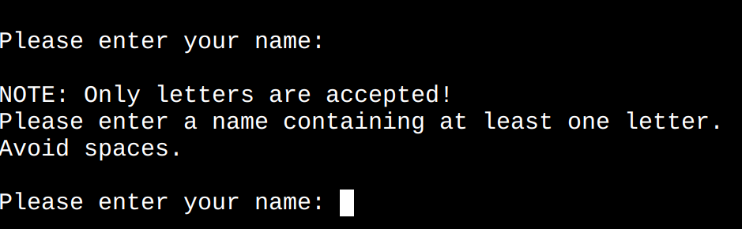

# Hangman

Hangman is a Python terminal game, which runs oin the Code Institute mock terminal on Heroku.

Users get a possibility to play a guessing game even if they do not have someone around to play with.

## How to play

 The player will have a total of nine attempts to correctly guess the word. Guessing multiple letters at once is not possible.If the playes enters a character other than a letter, they will receive an error message.

 When the player guess a letter, the game shows if it is correct and if it is, reveals its position in the word.

 If a letter is not in the word, a new image of the hangman is displayed, along with the number of attempts remaining.

 It is possible to play the game multiple times.

 ## Flowchart

 Flowchart was created using [Lucidchart](https://www.lucidchart.com/pages/sv).

 

 ## Features 

 ### Welcome message

 
  
  - Tells a player what type of game it is.
  
  - Gives information about the game, amount of attempts, and the possibility to play several times.

  - Requests player's name.

### Name Validation

#### Input validation and error-checking:

  
  - A player can only enter letters.

  - Nothing else but letters are accepted. 

  - A name should contain at least ONE letter.

### Ready to play?

#### Once validation is complete, the user is given the option to choose either to play or not.

I know it's very early in the game, but what if a user accidentally stumbled upon the game or immediately regretted it?

  
 - The player chooses to play:

    - 

       The game begins. Some time delay is added for animation feeling.

  - The player chooses NOT to play:
   
    - 

      The game welcomes the player to come back another time.
  
  - The player enters something else than 'yes' or 'no':
    
    - 
      
      An error message appear on the screen asking the player enter either 'yes' or 'no'.

 
### Enter a letter

  - This section shows the first hangman image.

  - A player gets to see the hidden word.

  - A player gets an opportunity to enter a letter.

  - Input validation: 
  
    - The letter is NOT in the word:

      

       - A player gets a message with the information about that.

       - Information about how many attempts are left is displayed.

       - The next hangman image is displayed.

       - A player can guess the next letter as long as the game is still in progress. 
    
    - The letter is ALREADY guessed:

      

       - A player gets a message with the information about that.

       - An opportunity to enter another letter appears on the screen.

    - The letter IS IN THE WORD:

      

       - A player gets a message with the information about that.

       - The game reveals the guessed letter's position in the word.

       - A player can guess the next letter as long as the game is still in progress. 

### The game is finished

#### What occurs when all letters are guessed or no attempts remain?

  - Game over:
   
    

      - "You have 0 attempts left" message is displayed on the screen.

      - The last hangman image with the GAME OVER print is printed out for the player.

      - The player receives the information about the word that was previously hidden by the underscores.

      - The game asks whether the player wants to play again or not.

  - A player wins:

    

      - Congratulations message is printed out for the player.

      - The game asks whether the player wants to play again or not.

### Would you like to play again?

  - YES:
   
    

     - A new random word that is currently hidden behind the underscores, appears on the screen.

     - A player gets an opportunity to enter a letter.

  - NO:

    

    A "Welcome back another time!" message appears on the screen.

  - Was it YES or NO?

    
  
    If a player enters something else than 'yes' or 'no', a question repeatedely appears on the screen.

## Solved Bugs after Deployment:

  - When a player started a new round after losing, the letters that were correctly guessed in previous rounds were automatically entered as correctly guessed letters even for the new word. I solved the problem by resetting the list of correctly guessed letters every time a player loses the game.

  - When a player plays another round after losing, a message was displayed stating that a letter had already been guessed, even if it hadn't been guessed in that particular round. I solved the problem by resetting the list of all the guessed letters every time a player loses the game.

  - The same hangman image was displayed twice. The image was displayed at the beginning of the game. The same image was even displayed when the player guessed incorrectly for the first time. I solved this problem by adding one more image to the hangman list to make it work with indexes.

## Testing

### Validator testing

No errors were found when passing through the official [PEP8 Linter](https://pep8ci.herokuapp.com/).

## Credits

### Media

Full Emoji List was found on [Unicode](https://unicode.org/emoji/charts/full-emoji-list.html).

### Content

  - [Random Word Generator](https://randomwordgenerator.com/) was used to generate random words.

  - I got the inspiration for my hangman images by the images shown in the [How to build HANGMAN with Python in 10 MINUTES](https://www.youtube.com/watch?v=m4nEnsavl6w) YouTube video.

  - Thanks to the Tutor Support for helping me finding a solution for looping over the word and replacing index with the guessed letter (if the letter guessed is in the word).

  - Instructions for replacing underscores with letters and revealing their correct positions in the word upon correct guesses come from [GeeksForGeeks](https://www.geeksforgeeks.org/python-program-for-word-guessing-game/).

## Deployment

 1. Sign up for Heroku and accept terms of service.

 2. Click the **"Create a new app"** button.

 3. Name the app (a name must be unique) and choose a region.

 4. Create a _Config Var_ with the key **PORT** and the value **8000**.

 5. Click **"Add buildpack"** and the following buildpacks (in the order presenting):
     - Python
     - NodeJS

 6. Click on the **"Deploy"** section on the top of the page.

 7. Select **GitHub** as deployment method and click **"The connect to GitHub"** button.

 8. Search for the repository for this project, _hangman_. 

 9. Click **"Connect"** to link up Heroku app to the GitHub repository.

 10. Click the **"Enable Automatic Deploys"** button to make it possible for Heroku to rebuild the app a new change is pushed to GitHub repository.

 11. Click **"Deploy Branch"**.

